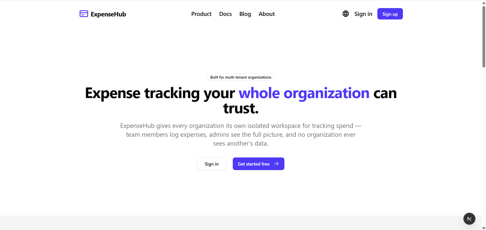

# ExpenseHub

A multi-tenant SaaS expense tracking application built to demonstrate core cloud
computing concepts — tenant-isolated data architecture, containerized deployment,
managed cloud storage, IAM-based access control, and network security.

Built as a course project for [Your Course Name], demonstrating the practical
application of IaaS, PaaS, and SaaS layers in a real deployed system.

## What it does

ExpenseHub allows multiple organizations to use the same deployed application
while keeping each organization's financial data completely isolated from every
other organization. Each org can:

- Track and categorize expenses
- Invite team members with role-based access (admin / member)
- View organization-scoped expense history and summaries

## Tech Stack

- **Frontend/Backend**: Next.js 16 (App Router), TypeScript, Tailwind CSS, shadcn/ui
- **Authentication & Organizations**: Clerk
- **Database**: PostgreSQL via Drizzle ORM
- **Deployment**: Docker, Google Cloud Platform (Compute Engine, Cloud SQL, Cloud Storage)

## Cloud Architecture

This project demonstrates the following cloud computing concepts:

| Unit | Concept | Implementation |
|------|---------|-----------------|
| Unit I | IaaS / PaaS / SaaS layers | [Architecture doc](./docs/architecture.md) |
| Unit II | Compute & Virtualization | Dockerized app deployed on a GCP Compute Engine VM |

<!--
TODO: the table above is incomplete. The Unit IV row (and anything after it) was
cut off when this content was pasted into chat and was not recovered. The last
fragment received was:

| Unit IV | Cloud Storage | Transaction data in Cloud SQL (tenant-isolated), receipts in Cloud

Finish this row and add any remaining rows (e.g. Unit III, Unit V) before submitting.
-->

## Team

- [Team member name]

## License

Distributed under the [MIT License](./LICENSE).
